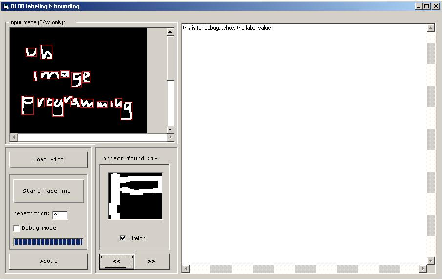



## blob labeling N bounding

### Description

label black n white blob image and draws boxes around it..

hard to find VB code that does this easy but useful task in image processing..so i write the code n want to share it..sory bout the lack of comments i put..but u can refer to the pdf files i included for the basic algorithm..
 
### More Info
 

             |
---                |---
**Submitted On**   |2007-11-07 17:27:48
**By**             |[Jefri Mustapa](https://github.com/Planet-Source-Code/PSCIndex/blob/master/ByAuthor/jefri-mustapa.md)
**Level**          |Beginner
**User Rating**    |5.0 (10 globes from 2 users)
**Compatibility**  |VB 6\.0
**Category**       |[Graphics](https://github.com/Planet-Source-Code/PSCIndex/blob/master/ByCategory/graphics__1-46.md)
**World**          |[Visual Basic](https://github.com/Planet-Source-Code/PSCIndex/blob/master/ByWorld/visual-basic.md)
**Archive File**   |[blob\_label20901511102007\.zip](https://github.com/Planet-Source-Code/jefri-mustapa-blob-labeling-n-bounding__1-69470/archive/master.zip)

